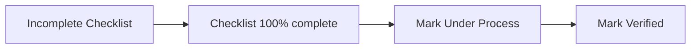

# B-TRACE User Guide

**B-TRACE** (Birth Tracking for Registration and Certificate Entries) is a desktop/web application for the City Civil Registry Office (CCRO). It helps staff track delayed birth registration applicants, manage document requirements by age and situation, fill official forms, and generate printable PDFs.

---

## Table of contents

1. [Getting started](#1-getting-started)
2. [Main navigation](#2-main-navigation-left-sidebar)
3. [Dashboard](#3-dashboard)
4. [Late Registration list](#4-late-registration-list)
5. [Applicant profile](#5-applicant-profile)
6. [Application status workflow](#6-application-status-workflow)
7. [Document checklist](#7-document-checklist-core-workflow)
8. [Certificate of Live Birth](#8-certificate-of-live-birth-colb)
9. [Affidavits and certification](#9-affidavits-and-certification)
10. [Front PDF and Back PDF](#10-front-pdf-and-back-pdf)
11. [Edit and delete](#11-edit-and-delete)
12. [Late Registration (BRAP)](#12-late-registration-brap-separate-menu)
13. [Backup and restore](#13-backup-and-restore)
14. [Recommended daily workflow](#14-recommended-daily-workflow)
15. [Tips and troubleshooting](#15-tips-and-troubleshooting)
16. [Age groups and conditional flags](#16-age-groups-and-conditional-flags-reference)

---

## 1. Getting started

### First-time setup

On a new installation with no accounts yet, the app opens **First-time Setup** instead of login.

1. Enter **Username**, **Password** (minimum 4 characters), and **Confirm Password**.
2. Click **Create Account**. You are redirected to **Login**.

### Sign in

1. Open the application (browser in development, or the packaged Electron desktop app).
2. On the **Login** screen, enter your username and password.
3. Click **Login**. Invalid credentials show an error; successful login takes you to the **Dashboard**.

### Sign out

Use **Logout** at the bottom of the left sidebar. You return to the login page.

---

## 2. Main navigation (left sidebar)

The sidebar header shows **B-TRACE** with the full name *Birth Tracking for Registration and Certificate Entries*, and the tag **Document Requirements**.

| Menu item | Purpose |
|-----------|---------|
| **Dashboard** | Overview, statistics, applications-over-time chart, database backup |
| **Late Registration** | Standard delayed registration records |
| **Late Registration (BRAP)** | Separate workflow for BRAP records (simpler checklist) |
| **Logout** | End session |

---

## 3. Dashboard

After login you see:

- **Summary cards**
  - **Total Late Registrations** — All recorded late registrations (standard and BRAP combined).
  - **Completed Registrations** — Cases marked **Verified** by staff.
  - **Pending Registrations** — Everyone not yet verified.
- **Applications over time** — Bar chart of new records in the selected period. Two series appear when both types exist in that period:
  - **Late Registration** (standard track)
  - **Late Registration (BRAP)** (BRAP track)

  Use the range buttons: **Last 7 days**, **Last 14 days**, **12 months**, **Year**, or **Custom** (set **From** and **To** dates).

- **Export backup** / **Import backup** — In the page header. Download or restore a `.zip` containing the database and all attachments (for moving data between machines or disaster recovery). **Import backup** asks you to confirm before merging data.

To add a new person, open **Late Registration** or **Late Registration (BRAP)** from the sidebar and use **Add late registration** or **Add Late Registration (BRAP)** on that list—not from the Dashboard.

---

## 4. Late Registration list

Open **Late Registration** from the sidebar (standard delayed registration track).

### Find and filter

- **Search** — Matches name, place of birth, or date of birth (several date formats work). The box placeholder says *Search by name or date of birth…* but place of birth is included.
- **Status filters** — **All**, **Incomplete Checklist**, **Under Process**, **Verified**.
- **Pagination** — Long lists use **Previous** / **Next** and page numbers at the bottom.

Each row shows:

- Name (LAST, FIRST format on the list)
- Date of birth
- Document progress (`X/Y complete`) or `—` if the checklist was never opened
- Status badge (color-coded)

Click a row to open that person's **profile**.

### Add a new late registration

1. Click **Add late registration** (opens a modal on the list page).
2. Fill **Basic details** (required: first name, last name, date of birth). Optionally set **Gender** (**Male** / **Female**). **Gender** is only on this add modal—not on the profile **Edit** dialog.
3. Under **Conditional document requirements**, check everything that applies (see [Section 16](#16-age-groups-and-conditional-flags-reference)). Exact labels:
   - **Out of Town (attach Affidavit w/ Corroboration for Out-of-Town Applicant (Legal Office))**
   - **Registrant is deceased (attach death certificate)**
   - **One parent is foreigner (attach passport or Bureau of Immigration cert.)**
   - When **Out of Town** is checked, choose **Informant role**: **Document owner** or **Representative** (controls which out-of-town print template appears on the profile).
4. Click **Add late registration**. You are taken to the new profile.

> Names and addresses are stored in uppercase as you type.

### Place of birth (when adding or editing)

Under **Place of birth**, fill three fields:

| Field | Notes |
|-------|--------|
| **Address** * | Hospital or birth address (e.g. `CONNELLY - CUMMINGS CLINIC`) |
| **City** * | Start typing; pick a suggestion from the Philippine cities list to auto-fill **Province**, or type city and province manually |
| **Province** | Filled when you select a city suggestion, or enter manually (e.g. `LANAO DEL NORTE`) |

The app stores these as one combined value for forms and lists. **Certificate of Live Birth** uses the same address, city, and province. Older records entered as a single comma-separated line (`address, city, province`) still open correctly when you **Edit**.

---

## 5. Applicant profile

The profile header shows the name in **LAST, FIRST** form (e.g. **RODRIGUEZ, NORMA KENJI**).

### Action buttons (top row)

| Button | What it does |
|--------|----------------|
| **Certificate of Live Birth** (green) | Official COLB data entry form |
| **Document checklist** | Required documents, uploads, camera capture |
| **Paternity Affidavit** | Paternity affidavit form |
| **Delayed Birth Affidavit** | Delayed registration affidavit |
| **Two Witnesses Affidavit** | Affidavit of Two Witnesses (Legal Office) — fill form, preview or save PDF (Long or A4) |
| **AUSF (Adult)** / **AUSF (0–6)** / **AUSF (7–17)** | Affidavit to Use Surname of the Father — label depends on age; **hidden** if parents are marked married (marriage contract on file) |
| **Out-of-Town Affidavit (Applicant)** / **(Representative)** | Shown only when **Out of town** is set — label matches informant role; Legal Office affidavit with corroboration (see [Section 9](#9-affidavits-and-certification)) |
| **Print certification** | Delayed registration certification letter/PDF |
| **Front PDF** | Generate/preview front of combined COLB + checklist PDF |
| **Back PDF** | Generate/preview back (affidavits, etc.) |
| **Edit** | Update profile details and conditional flags |
| **Delete** | Remove the record (confirmation required) |

**Front PDF** and **Back PDF** — After the document checklist is **100% complete** (every required item has at least one attachment), click these buttons to open options to **print/preview** or **save** the front and back pages of the generated Certificate of Live Birth PDF.

| Button | Menu options |
|--------|----------------|
| **Front PDF** | **Print Front** (preview in browser) · **Save Front as PDF** (desktop app) |
| **Back PDF** | **Print Back** (preview) · **Save Back as PDF** (desktop app) |

> **Note:** **Front PDF** and **Back PDF** stay **disabled (grayed out)** until the checklist is fully complete. They do **not** require staff to mark the case **Under Process** or **Verified**—only completed document attachments. The tooltip says: *Complete the document checklist first*.

To change **contact number** or **conditional requirement** flags, use **Edit** on this profile—not the certification letter screen. The profile **Edit** dialog does **not** change legal name, date of birth, or place of birth (those are set when the record is first added).

### Status banner

Below the buttons:

- **Status** badge — e.g. **Incomplete Checklist** (amber).
- Message: *Complete every checklist item to enable Under Process and Verified.*

When the checklist is **100% complete**:

- **Mark Under Process** and **Mark Verified** appear.
- Staff can move the case through internal processing.

**Important:** On the **Document checklist** page, if you have unsaved edits, you must wait for auto-save (about 1.5 seconds after you stop editing) before staff status buttons work. The message then says: *Save the checklist before setting Under Process or Verified.*

### Child identification section

Displays:

- Full name, date of birth (DD-MM-YYYY), age, gender
- **Place of birth** (address, city, province on separate lines), contact number (see [Place of birth](#place-of-birth-when-adding-or-editing) above)
- **Age group (requirements)** — e.g. `18 to 59` (drives which documents are required); not shown for Late Registration (BRAP) records
- **Conditional requirements** — If any were set at add/edit (deceased registrant, foreign parent, out-of-town, etc.)
- **Created** / **Updated** dates
- **Documents checklist** — Progress bar or links **View checklist →** / **Open document checklist** (or *Open document checklist to get started* when empty)

Adult delayed registrations (e.g. age group **18 to 59**) use age-specific items such as baptismal, school records, voter's certification, NBI/police clearance, plus general items (National ID, PSA Negative, affidavits, barangay certifications, 2×2 photo).

---

## 6. Application status workflow

Statuses work in this order:

| Status | Meaning |
|--------|---------|
| **Incomplete Checklist** | One or more required documents not yet attached/checked |
| **Under Process** | Checklist complete; staff marked the case in progress |
| **Verified** | Checklist complete; staff marked the case verified |

Checklist completion is automatic: each requirement is "done" when it has at least one attachment (upload or camera). You do not manually tick checkboxes—they reflect attachments.

---

## 7. Document checklist (core workflow)

Open via **Document checklist** on the profile or the green link under **Documents checklist**.

### Structure

Requirements are grouped into steps (when applicable):

1. **General documents** — Same for all applicants (National ID, PSA Negative, affidavits, barangay certifications, 2×2 photo, etc.)
2. **Age-specific requirements** — Based on age group:
   - **1 month 1 day to 6 years**
   - **7 to 17 years**
   - **18 to 59 years**
   - **60 plus**
3. **Conditional documents** — Only if flags were set (death certificates, foreign parent ID, out-of-town affidavit, marriage contract vs AUSF, etc.)

### Per requirement you can

- Add **Notes** (optional)
- **Attach file(s)** from the computer
- **Take Picture** — For the 2×2 photo ID (crop overlay, white background)
- **Scan Document** — For other items (document-oriented crop)
- **View** / **Remove** attachments (**Remove attachment?** dialog with **Cancel** / **Remove**)

### Saving

- Changes **auto-save** about **1.5 seconds** after you stop editing.
- Leaving with unsaved changes opens **Save changes?** — choose **Save and leave**, **Stay on Page**, or **Discard Changes**.
- Progress bar at top shows **% complete**.

**Back link** at the top: **← Back to late registration** or **← Back to Late Registration (BRAP)**.

### Out of town on checklist (Late Registration only)

- For **Late Registration** (not BRAP), checking **Out of town** adds **Affidavit w/ Corroboration for Out-of-Town Applicant (Legal Office)** to the checklist — attach the signed document like any other requirement.
- For **Late Registration (BRAP)**, the same affidavit is **not** on the checklist; use the profile's **Out-of-Town Affidavit** button to fill and print the form instead (see [Section 12](#12-late-registration-brap-separate-menu)).

---

## 8. Certificate of Live Birth (COLB)

1. Click **Certificate of Live Birth** (green).
2. Enter all fields matching the official Municipal Form No. 102 layout (child, parents, birth facts, attendant, etc.). City fields support Philippine city autocomplete where shown.
3. Changes **auto-save** shortly after you stop editing (about **0.7 seconds**); a **Saved** toast confirms. There is no separate **Save** button.

Many other outputs (AUSF, Front/Back PDF, certification) **pull data from this form**. If COLB is empty, AUSF print may show an error to complete COLB first.

**Back link:** **← Back to applicant**.

---

## 9. Affidavits and certification

### Paternity Affidavit

Separate form for acknowledgment/admission of paternity. Fills **auto-save**; use with back PDF mapping where applicable. **Back link:** **← Back to Applicant**.

### Delayed Birth Affidavit

Affidavit for delayed registration of birth. Fills **auto-save**; fields can appear on the **back** PDF. **Back link:** **← Back to Applicant**.

### AUSF (Affidavit to Use Surname of the Father)

- Shown only when parents are **not** marked as married.
- Variant by age:
  - **AUSF (0–6)** — Child 0–6
  - **AUSF (7–17)** — Minor 7–17
  - **AUSF (Adult)** — 18+
- Requires saved **Certificate of Live Birth** data.
- On the print page: choose **A4** or **Long (8.5 in × 13 in)**, then **Preview PDF**, **Print**, or **Save PDF** (save requires the desktop/Electron app; you can **Open in Microsoft Edge or Google Chrome** after save).

### Two Witnesses Affidavit

1. On the profile, click **Two Witnesses Affidavit** (opens the print page: **Affidavit of Two Witnesses**).
2. Click **Edit form**, enter witness and affiant details, then **View document** when finished. Changes **auto-save** while editing.
3. Choose **A4** or **Long (8.5 in × 13 in)**, then **Preview PDF**, **Print**, or **Save PDF** (save requires the desktop/Electron app).
4. After saving on desktop, you can **Open in Microsoft Edge or Google Chrome** from the profile if a link appears.

This affidavit is also a **checklist item** (general documents). Attach the signed copy on the checklist; use the print form to prepare the official layout.

### Out-of-Town Affidavit

Shown on the profile only when **Out of town** was set at add/edit (Late Registration and BRAP).

| Informant role (at add/edit) | Profile button label |
|------------------------------|----------------------|
| **Document owner** | **Out-of-Town Affidavit (Applicant)** |
| **Representative** | **Out-of-Town Affidavit (Representative)** |

1. Click the out-of-town button on the profile.
2. Click **Edit form**, complete the affidavit fields (data can pull from **Certificate of Live Birth** where applicable), then **View document**.
3. Choose **A4** or **Long (8.5 in × 13 in)**, then **Preview PDF**, **Print**, or **Save PDF**.

**Late Registration:** Also attach the signed affidavit on the document checklist under the out-of-town requirement.

**Late Registration (BRAP):** There is **no** out-of-town line on the checklist — the print form is the only in-app step for this affidavit.

**Standard Late Registration:** Change informant role via **Edit** on the profile (when **Out of Town** is checked).

**BRAP:** Out of town is set automatically from place of birth (see Section 12); change **Informant** (**Document owner** / **Representative**) via **Edit** when the **Out of town** section is shown.

### Print certification

Generates the **Delayed Registration of Birth** certification letter. Open it from **Print certification** on the profile (standard or BRAP).

**On the letter preview:**

- **Click to edit request person** — Click the name in *“issued upon the request of …”* to type who requested the certification. Press **Enter** or click outside the field when finished.
- **Click to edit certification purpose** — Click the purpose text (e.g. **ANY LEGAL**) in *“for … requirement purposes”* to change it. Press **Enter** or click outside when finished.
- **Signatory** — Choose from the dropdown (city civil registrar or registration officers).
- Changes **save automatically** (about one second after you stop editing) to the Certificate of Live Birth record.
- **Preview PDF** or **Save PDF** — **A4** or **Long** paper size (save requires the desktop/Electron app).

> **Note:** To edit **contact** or **conditional flags**, use **Edit** on the profile—not these click-to-edit fields on the certification letter. Legal name and date of birth cannot be changed after the record is created.

---

## 10. Front PDF and Back PDF

Available on the profile **only when the document checklist is 100% complete** (standard Late Registration or BRAP).

### Front PDF

- Combines **Certificate of Live Birth** field positions with the **Document Requirements Checklist** on the official front layout.
- Click **Front PDF** → **Print Front** (browser preview) or **Save Front as PDF** (saves to disk in the desktop app; you can open it in Edge or Chrome).

### Back PDF

- Maps **Paternity Affidavit**, **Delayed Registration Affidavit**, and related marks to the back of the form.
- Click **Back PDF** → **Print Back** or **Save Back as PDF**.

Both require a **complete checklist** (every line has an attachment) and a filled **Certificate of Live Birth** (and related affidavits where used). Staff **Verified** status is **not** required to enable these buttons.

---

## 11. Edit and delete

### Edit

- On the profile, click **Edit**. Dialog title: **Edit late registration** or **Edit Late Registration (BRAP)**.
- You can update **contact number** and **conditional requirement** checkboxes only. **Name**, **date of birth**, and **place of birth** are not editable after create (set correctly on **Add**).
- Submit with **Update late registration** or **Update Late Registration (BRAP)**.
- Changing conditions **updates the checklist** (new items may appear; removed conditions may drop items—confirm attachments after edits).

### Delete

- Opens a confirmation dialog (**Delete late registration** or **Delete Late Registration (BRAP) record**).
- Enter the deletion password in **Enter password to confirm deletion** (placeholder **Enter Password**), then click **Delete**.
- **Permanent** — removes the record, checklist, attachments, and related saved form data from the local database.

---

## 12. Late Registration (BRAP) (separate menu)

**Late Registration (BRAP)** is a separate registration track. Use the **Late Registration (BRAP)** item in the sidebar—not **Late Registration**—for these records.

### How it differs from Late Registration (standard)

| Topic | Late Registration | Late Registration (BRAP) |
|-------|-------------------|--------------------------|
| Checklist | General + **age-specific** + conditionals | **5 general** items + conditional items (marriage certificate, parent/guardian I.D., Muslim — no AUSF line on checklist) |
| Age group | Used for extra documents | **Not used** |
| Add/Edit flags | Out of town (+ informant role), deceased registrant, foreign parent | Document flags (checklist); **Out of town** auto from city ≠ Iligan + **Informant** for print only |
| Out-of-town checklist item | Yes — attach signed affidavit on checklist | **No** — use **Out-of-Town Affidavit** on profile only |
| Front / Back PDF | Enabled when checklist 100% complete | **Same rule** — not tied to staff Verified |
| Place of birth | Address, City, Province fields (see Section 4) | **Same fields** |

### Add a BRAP record

1. Open **Late Registration (BRAP)** → **Add Late Registration (BRAP)**.
2. Fill basic details (name, date of birth, **Place of birth**, contact, etc.).
3. **Out of town** (when it applies): If **City** is not **ILIGAN CITY**, the **Out of town** section appears automatically (*For the affidavit print form.*). Choose **Informant**: **Document owner** or **Representative**. This does **not** add a checklist row. There is no manual “Out of town” checkbox on BRAP add.
4. Under **Conditional document requirements**, check all that apply (see [BRAP flags](#late-registration-brap-only) in Section 16). These add checklist items.
5. Click **Add Late Registration (BRAP)**—you are taken to the BRAP profile.

### BRAP document checklist

**Always required (general):**

1. National I.D.
2. Brgy. indigency
3. Affidavit of Two Witnesses (Legal Office)
4. Brgy. Certification (Facts of Birth)
5. 2×2 Photo I.D. with white background

**Conditional (from add/edit flags and marriage status):**

- **Parents are married (marriage contract)** → **Marriage Certificate** on checklist.
- **Registrant is a Child (parent/s or guardian valid I.D.)** → Valid I.D. of parent/s or guardian.
- **Registrant is a Muslim (Muslim attachment)** → Muslim attachment.

The checklist has **no age-specific step**—only general and conditional groups. Progress, attachments, and auto-save work the same as for standard Late Registration.

### BRAP profile

Same action buttons as a standard profile: **Certificate of Live Birth**, **Document checklist**, affidavits, **Print certification**, **Front PDF**, **Back PDF**, **Edit**, **Delete**.

- **Front PDF** / **Back PDF** — Same as Section 10: enabled only when every checklist item has an attachment; use **Print** or **Save as PDF** from the dialog. Not blocked by staff **Verified** status.
- **Place of birth** — Same three-field form as standard Late Registration (Address, City with autocomplete, Province).
- **AUSF** — Not on the BRAP checklist. If parents are **not** married, use the profile **AUSF** button (by age) to print the affidavit; attach the signed copy only if your office requires it outside the checklist.

Use **Late Registration** for standard delayed registration only; use **Late Registration (BRAP)** for BRAP program records.

---

## 13. Backup and restore

On the **Dashboard** (header buttons):

1. **Export backup** — Downloads a `.zip` with `trace.db` and all attachment files.
2. **Import backup** — Choose a previously exported `.zip`. Confirm in **Import Backup** (*Import new applicants and attachments from this backup? Existing matching applicants will be skipped.*) with **Import** or **Cancel**. Merges records and attachments without wiping unrelated data when possible.

Use this for:

- Moving data from a field laptop to the main office
- Scheduled backups
- Recovery after hardware failure

---

## 14. Recommended daily workflow

### Standard Late Registration (delayed registration)

1. **Late Registration** → **Add late registration** — Fill **Place of birth** (Address, City, Province); use city autocomplete when possible.
2. **Open document checklist** → Complete every general, age-specific, and conditional item with uploads or scans.
3. Wait for auto-save; confirm progress shows **100%**.
4. On profile, click **Mark Under Process** when intake review starts.
5. Complete **Certificate of Live Birth** and affidavits as needed.
6. Use **AUSF** (correct age variant) if parents are not married; use **Out-of-Town Affidavit** if out of town (attach checklist copy for standard Late Registration).
7. Use **Two Witnesses Affidavit** when that item is on the checklist.
8. **Front PDF** / **Back PDF** → **Print** or **Save as PDF** (buttons enabled after checklist is complete).
9. **Print certification** → click to edit **request person** and **purpose** on the letter if needed; preview or save PDF.
10. **Mark Verified** when the case is fully processed.

### Late Registration (BRAP)

1. **Late Registration (BRAP)** → **Add Late Registration (BRAP)** → set **Place of birth** (out-of-town affidavit section appears if city ≠ Iligan) and document flags → complete the shorter checklist (no age-specific step; no out-of-town checklist line; no AUSF checklist line).
2. **Certificate of Live Birth**, **Two Witnesses Affidavit**, **Out-of-Town Affidavit** (if flagged), **AUSF** from the profile if parents are not married, and other affidavits as needed.
3. When checklist is **100%**, use **Front PDF** / **Back PDF** and **Print certification** (same rules as above).
4. **Mark Under Process** / **Mark Verified** when appropriate.

---

## 15. Tips and troubleshooting

| Issue | What to check |
|-------|----------------|
| Front/Back PDF disabled | Finish every checklist item (attachments on each line); staff **Verified** is not required |
| Status stuck at Incomplete Checklist | All items have attachments; then use Mark Under Process |
| COLB city/province empty | **Edit** the record and fill **Place of birth** City and Province (use city autocomplete), then save **Certificate of Live Birth** |
| AUSF button missing | Parents marked married — use marriage contract on checklist instead |
| AUSF won't print | Save **Certificate of Live Birth** first |
| Can't mark Verified on checklist page | Wait for auto-save to finish (~1.5 s after last edit) |
| Wrong documents listed | **Edit** profile — verify date of birth and conditional checkboxes |
| BRAP case in wrong list | Open **Late Registration (BRAP)**, not **Late Registration** |
| Certification name/purpose won't change | Click the **bold text** on the letter (request person / purpose), not **Edit** on profile |
| Out-of-town button missing | **Late Registration:** **Edit** and check **Out of Town**. **BRAP:** set **City** outside **ILIGAN CITY** on add/edit, then set **Informant** |
| Wrong out-of-town template | **Edit** profile → change **Informant role** under **Out of town** |
| BRAP has no out-of-town checklist line | Expected — use **Out-of-Town Affidavit** on the profile, not the checklist |
| Save certification PDF fails | Use the **desktop (Electron)** app |
| Data on another PC | Export backup on source; import on destination |
| Cannot change name or DOB | Set correctly on **Add**; profile **Edit** only changes contact and flags |
| Delete fails | Enter the correct deletion password in the confirm dialog |
| BRAP out-of-town missing | Set **City** to something other than **ILIGAN CITY**, or use **Edit** to set **Informant** when the section is visible |
| BRAP out-of-town when not needed | Use **ILIGAN CITY** as place-of-birth city if birth was in Iligan |

---

## 16. Age groups and conditional flags (reference)

### Age groups (from date of birth)

| Age group | Approximate ages |
|-----------|------------------|
| 1m1d to 6 | Infant / young child |
| 7 to 17 | Minor |
| 18 to 59 | Adult |
| 60 plus | Senior |

### Conditional flags when adding/editing (Late Registration)

| Flag | Effect |
|------|--------|
| Out of town | Checklist: **Affidavit w/ Corroboration (Legal Office)**. Profile: **Out-of-Town Affidavit** button (Applicant or Representative template from informant role below). |
| ↳ Informant: **Document owner** | Print template: **Out-of-Town Affidavit (Applicant)** |
| ↳ Informant: **Representative** | Print template: **Out-of-Town Affidavit (Representative)** |
| Registrant deceased | Death certificate (registrant) on checklist |
| One parent foreigner | Passport or BI certificate on checklist |

### Late Registration (BRAP) only

**Conditional document requirements** (checklist) — exact checkbox labels:

| Checkbox label | Adds to checklist |
|----------------|-------------------|
| Parents are married (marriage contract) | **Marriage Certificate** |
| Registrant is a Child (parent/s or guardian valid I.D.) | Valid I.D. of parent/s or guardian |
| Registrant is a Muslim (Muslim attachment) | Muslim attachment |

**Out of town** (add/edit — section title **Out of town**, intro *For the affidavit print form.*):

| Rule | Effect |
|------|--------|
| **City** ≠ **ILIGAN CITY** | Section appears with **Out-of-Town** badge; profile shows **Out-of-Town Affidavit**; **not** on checklist |
| **Informant**: **Document owner** / **Representative** | Same template choice as standard Late Registration |

When parents are **not** married on a BRAP record, the checklist expects neither marriage certificate nor AUSF; use the profile **AUSF** button to prepare the affidavit if needed.

---

*Document version: aligned with Trace-App-CCRO as of June 2026.*
