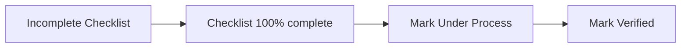

# B-TRACE User Guide

**B-TRACE** (Birth Tracking for Registration and Certificate Entries) is a desktop/web application for the City Civil Registry Office (CCRO). It helps staff track delayed birth registration applicants, manage document requirements by age and situation, fill official forms, and generate printable PDFs.

For a shorter technical walkthrough, see [Demo.md](./Demo.md). For installation and development, see [trace-app/README.md](./trace-app/README.md).

**PDF:** [USER_GUIDE.pdf](./USER_GUIDE.pdf) — regenerate anytime from the `trace-app` folder:

```bash
npm run export:user-guide-pdf
```

---

## Table of contents

1. [Getting started](#1-getting-started)
2. [Main navigation](#2-main-navigation-left-sidebar)
3. [Dashboard](#3-dashboard)
4. [Applicants list](#4-applicants-list)
5. [Applicant profile](#5-applicant-profile)
6. [Application status workflow](#6-application-status-workflow)
7. [Document checklist](#7-document-checklist-core-workflow)
8. [Certificate of Live Birth](#8-certificate-of-live-birth-colb)
9. [Affidavits and certification](#9-affidavits-and-certification)
10. [Front PDF and Back PDF](#10-front-pdf-and-back-pdf)
11. [Edit and delete](#11-edit-and-delete)
12. [COLB BRAP](#12-colb-brap-separate-menu)
13. [Backup and restore](#13-backup-and-restore)
14. [Recommended daily workflow](#14-recommended-daily-workflow)
15. [Tips and troubleshooting](#15-tips-and-troubleshooting)
16. [Age groups and conditional flags](#16-age-groups-and-conditional-flags-reference)

---

## 1. Getting started

### Sign in

1. Open the application (browser in development, or the packaged Electron desktop app).
2. On the **Login** screen, enter your username and password.
3. Click **Login**. Invalid credentials show an error; successful login takes you to the **Dashboard**.

### Sign out

Use **Logout** at the bottom of the left sidebar. You return to the login page.

---

## 2. Main navigation (left sidebar)

| Menu item | Purpose |
|-----------|---------|
| **Dashboard** | Overview, charts, recent applicants, database backup |
| **Applicants** | Standard delayed registration records |
| **COLB BRAP** | Separate workflow for COLB BRAP records (simpler checklist) |
| **Logout** | End session |

The header shows **B-TRACE** and the tag **Document Requirements**, reflecting that document completeness is the core of the system.

---

## 3. Dashboard

After login you see:

- **Totals** — How many applicants exist and how many are **Verified** vs still pending.
- **Charts**
  - Applicants by **age group**
  - **Registration status** (Incomplete Checklist, Under Process, Verified)
  - **Applications over time** (filter: last 7/14 days, 12 months, year, or custom range)
- **Recent applicants** — Quick links to open a profile.
- **Add applicant** — Opens the same add form as on the Applicants list.
- **Export Backup** / **Import Backup** — Download or restore a `.zip` containing the database and all attachments (for moving data between machines or disaster recovery).

---

## 4. Applicants list

Open **Applicants** from the sidebar.

### Find and filter

- **Search** — By name, place of birth, or date of birth (several date formats work).
- **Status filters** — **All**, **Incomplete Checklist**, **Under Process**, **Verified**.

Each row shows:

- Name (LAST, FIRST format on the list)
- Date of birth
- Document progress (`X/Y complete`) or `—` if the checklist was never opened
- Status badge (color-coded)

Click a row to open that person's **profile**.

### Add a new applicant

1. Click **Add applicant**.
2. Fill **Basic details** (required: first name, last name, date of birth).
3. Under **Conditional document requirements**, check everything that applies (see [Section 16](#16-age-groups-and-conditional-flags-reference)). These add extra checklist items automatically.
4. Click **Add applicant**. You are taken to the new profile.

### Place of birth (when adding or editing)

Enter place of birth as **three parts separated by two commas**:

`Hospital or address, City, Province`

**Example:** `Connelly - Cummings Clinic, Calamba, Lanao Del Norte`

This helps the **Certificate of Live Birth** form split the address, city, and municipality/province automatically. If you use only **one comma** (city and province only), the COLB form may not fill city and province fields—you should enter the full three-part format when possible.

---

## 5. Applicant profile

The profile header shows the name in **LAST, FIRST** form (e.g. **RODRIGUEZ, NORMA KENJI**).

### Action buttons (top row)

| Button | What it does |
|--------|----------------|
| **Certificate of Live Birth** (green) | Official COLB data entry form |
| **Document checklist** | Required documents, uploads, camera capture |
| **Paternity Affidavit** | Paternity affidavit form |
| **Delayed Birth Affidavit** | Delayed registration affidavit |
| **AUSF (Adult)** / **AUSF (0–6)** / **AUSF (7–17)** | Affidavit to Use Surname of the Father — label depends on age; **hidden** if parents are marked married (marriage contract on file) |
| **Print certification** | Delayed registration certification letter/PDF |
| **Front PDF** | Generate/preview front of combined COLB + checklist PDF |
| **Back PDF** | Generate/preview back (affidavits, etc.) |
| **Edit** | Update applicant details and conditional flags |
| **Delete** | Remove the record (confirmation required) |

**Front PDF** and **Back PDF** — After the document checklist is **100% complete** (every required item has at least one attachment), click these buttons to open options to **print/preview** or **save** the front and back pages of the generated Certificate of Live Birth PDF.

| Button | Menu options |
|--------|----------------|
| **Front PDF** | **Print Front** (preview in browser) · **Save Front as PDF** (desktop app) |
| **Back PDF** | **Print Back** (preview) · **Save Back as PDF** (desktop app) |

> **Note:** **Front PDF** and **Back PDF** stay **disabled (grayed out)** until the checklist is fully complete. They do **not** require staff to mark the case **Under Process** or **Verified**—only completed document attachments. The tooltip says: *Complete the document checklist first*.

To change the applicant’s name, date of birth, contact, or conditional flags, use **Edit** on this profile—not the certification letter screen.

### Status banner

Below the buttons:

- **Status** badge — e.g. **Incomplete Checklist** (amber).
- Message: *Complete every checklist item to enable Under Process and Verified.*

When the checklist is **100% complete**:

- **Mark Under Process** and **Mark Verified** appear.
- Staff can move the case through internal processing.

**Important:** On the **Document checklist** page, if you have unsaved edits, you must wait for auto-save (about 1.5 seconds after you stop editing) before staff status buttons work. The message then says: *Save the checklist before setting Under Process or Verified.*

### Child identification section

Displays:

- Full name, date of birth (DD-MM-YYYY), age, gender
- **Place of birth**, contact number (see [Place of birth format](#place-of-birth-when-adding-or-editing) above)
- **Age group (requirements)** — e.g. `18 to 59` (drives which documents are required); not shown for COLB BRAP records
- **Conditional requirements** — If any were set at add/edit (deceased registrant, foreign parent, out-of-town, etc.)
- **Created** / **Updated** dates
- **Documents checklist** — Progress bar or link **Open document checklist to get started**

Adult delayed registrations (e.g. age group **18 to 59**) use age-specific items such as baptismal, school records, voter's certification, NBI/police clearance, plus general items (National ID, PSA Negative, affidavits, barangay certifications, 2×2 photo).

---

## 6. Application status workflow

Statuses work in this order:



| Status | Meaning |
|--------|---------|
| **Incomplete Checklist** | One or more required documents not yet attached/checked |
| **Under Process** | Checklist complete; staff marked the case in progress |
| **Verified** | Checklist complete; staff marked the case verified |

Checklist completion is automatic: each requirement is "done" when it has at least one attachment (upload or camera). You do not manually tick checkboxes—they reflect attachments.

---

## 7. Document checklist (core workflow)

Open via **Document checklist** on the profile or the green link under **Documents checklist**.

### Structure

Requirements are grouped into steps (when applicable):

1. **General documents** — Same for all applicants (National ID, PSA Negative, affidavits, barangay certifications, 2×2 photo, etc.)
2. **Age-specific requirements** — Based on age group:
   - **1 month 1 day to 6 years**
   - **7 to 17 years**
   - **18 to 59 years**
   - **60 plus**
3. **Conditional documents** — Only if flags were set (death certificates, foreign parent ID, out-of-town affidavit, marriage contract vs AUSF, etc.)

### Per requirement you can

- Add **Notes** (optional)
- **Attach file(s)** from the computer
- **Take Picture** — For the 2×2 photo ID (crop overlay, white background)
- **Scan Document** — For other items (document-oriented crop)
- **View** / **Remove** attachments (remove asks for confirmation)

### Saving

- Changes **auto-save** about **1.5 seconds** after you stop editing.
- Leaving the page with unsaved changes triggers a **navigation warning**.
- Progress bar at top shows **% complete**.

### Marriage / AUSF on checklist

- If parents are **married** (marriage contract on file), the checklist expects **Marriage contract** instead of **AUSF**.
- The profile's **AUSF** button is hidden when married; use marriage contract on the checklist instead.

---

## 8. Certificate of Live Birth (COLB)

1. Click **Certificate of Live Birth** (green).
2. Enter all fields matching the official Municipal Form No. 102 layout (child, parents, birth facts, attendant, etc.).
3. **Save** the form. Data is stored on the applicant record.

Many other outputs (AUSF, Front/Back PDF, certification) **pull data from this form**. If COLB is empty, AUSF print may show an error to complete COLB first.

---

## 9. Affidavits and certification

### Paternity Affidavit

Separate form for acknowledgment/admission of paternity. Fill, save, and use with back PDF mapping where applicable.

### Delayed Birth Affidavit

Affidavit for delayed registration of birth. Fill and save; fields can appear on the **back** PDF.

### AUSF (Affidavit to Use Surname of the Father)

- Shown only when parents are **not** marked as married.
- Variant by age:
  - **AUSF (0–6)** — Child 0–6
  - **AUSF (7–17)** — Minor 7–17
  - **AUSF (Adult)** — 18+
- Requires saved **Certificate of Live Birth** data.
- Choose paper size (**Long** or **A4**), preview, save PDF (desktop can open in Edge/Chrome).

### Print certification

Generates the **Delayed Registration of Birth** certification letter. Open it from **Print certification** on the applicant or COLB BRAP profile.

**On the letter preview:**

- **Click to edit request person** — Click the name in *“issued upon the request of …”* to type who requested the certification. Press **Enter** or click outside the field when finished.
- **Click to edit certification purpose** — Click the purpose text (e.g. **ANY LEGAL**) in *“for … requirement purposes”* to change it. Press **Enter** or click outside when finished.
- **Signatory** — Choose from the dropdown (city civil registrar or registration officers).
- Changes **save automatically** (about one second after you stop editing) to the Certificate of Live Birth record.
- **Preview** or **Save as PDF** — Long or A4 paper size (save requires the desktop/Electron app).

> **Note:** To edit the **applicant’s profile** (legal name, birth date, etc.), use **Edit** on the profile page—not these click-to-edit fields on the certification letter.

---

## 10. Front PDF and Back PDF

Available on the applicant or COLB BRAP profile **only when the document checklist is 100% complete**.

### Front PDF

- Combines **Certificate of Live Birth** field positions with the **Document Requirements Checklist** on the official front layout.
- Click **Front PDF** → **Print Front** (browser preview) or **Save Front as PDF** (saves to disk in the desktop app; you can open it in Edge or Chrome).

### Back PDF

- Maps **Paternity Affidavit**, **Delayed Registration Affidavit**, and related marks to the back of the form.
- Click **Back PDF** → **Print Back** or **Save Back as PDF**.

Both require a **complete checklist** (every line has an attachment) and a filled **Certificate of Live Birth** (and related affidavits where used). Staff **Verified** status is **not** required to enable these buttons.

---

## 11. Edit and delete

### Edit

- Updates name, DOB, contact, place of birth, and **conditional requirement** checkboxes.
- Changing conditions **updates the checklist** (new items may appear; removed conditions may drop items—confirm current attachments after edits).

### Delete

- Opens a confirmation dialog.
- **Permanent** — removes applicant, checklist, attachments, and related saved form data from the local database.

---

## 12. COLB BRAP (separate menu)

**COLB BRAP** is a separate registration track. Use the **COLB BRAP** item in the sidebar—not **Applicants**—for these records.

### How it differs from Applicants

| Topic | Applicants | COLB BRAP |
|-------|------------|-----------|
| Checklist | General + **age-specific** + conditionals | **5 general** items + up to 3 conditionals |
| Age group | Used for extra documents | **Not used** |
| Add/Edit flags | Out of town, deceased registrant, foreign parent | Parents married, child registrant, Muslim attachment |
| Front / Back PDF | Enabled when checklist 100% complete | **Same rule** — not tied to staff Verified |
| Place of birth | Three-part comma format (see Section 4) | **Same format** |

### Add a COLB BRAP record

1. Open **COLB BRAP** → **Add COLB BRAP**.
2. Fill basic details (name, date of birth, place of birth, contact, etc.).
3. Under **COLB BRAP conditional requirement**, check all that apply (see [COLB BRAP flags](#colb-brap-only) in Section 16).
4. Save—you are taken to the COLB BRAP profile.

### COLB BRAP document checklist

**Always required (general):**

1. National I.D.
2. Brgy. indigency
3. Affidavit of Two Witnesses (Legal Office)
4. Brgy. Certification (Facts of Birth)
5. 2×2 Photo I.D. with white background

**Conditional (from add/edit flags):**

- **Parents are married** → Marriage certificate on checklist (AUSF not used).
- **Parents not married** → AUSF on checklist; profile may show **AUSF** by age.
- **Registrant is a child** → Valid I.D. of parent/s or guardian.
- **Muslim registrant** → Muslim attachment.

The checklist has **no age-specific step**—only general and conditional groups. Progress, attachments, and auto-save work the same as for Applicants.

### COLB BRAP profile

Same action buttons as a standard applicant profile: **Certificate of Live Birth**, **Document checklist**, affidavits, **Print certification**, **Front PDF**, **Back PDF**, **Edit**, **Delete**.

- **Front PDF** / **Back PDF** — Same as Section 10: enabled only when every checklist item has an attachment; use **Print** or **Save as PDF** from the dialog. Not blocked by staff **Verified** status.
- **Place of birth** — Use `Hospital or address, City, Province` with two commas when entering on add/edit.

Use **Applicants** for standard delayed registration only; use **COLB BRAP** for BRAP program records.

---

## 13. Backup and restore

On the **Dashboard**:

1. **Export Backup** — Downloads a `.zip` with `trace.db` and all attachment files.
2. **Import Backup** — Upload a previously exported `.zip`; merges records and attachments without wiping unrelated data when possible.

Use this for:

- Moving data from a field laptop to the main office
- Scheduled backups
- Recovery after hardware failure

---

## 14. Recommended daily workflow

### Standard Applicants (delayed registration)

1. **Add applicant** — Use three-part **place of birth** (`address, city, province`) when possible.
2. **Open document checklist** → Complete every general, age-specific, and conditional item with uploads or scans.
3. Wait for auto-save; confirm progress shows **100%**.
4. On profile, click **Mark Under Process** when intake review starts.
5. Complete **Certificate of Live Birth** and affidavits as needed.
6. Use **AUSF** (correct age variant) if parents are not married.
7. **Front PDF** / **Back PDF** → **Print** or **Save as PDF** (buttons enabled after checklist is complete).
8. **Print certification** → click to edit **request person** and **purpose** on the letter if needed; preview or save PDF.
9. **Mark Verified** when the case is fully processed.

### COLB BRAP

1. **COLB BRAP** → **Add COLB BRAP** → set conditional flags → complete the shorter checklist (no age-specific step).
2. **Certificate of Live Birth** and affidavits as needed.
3. When checklist is **100%**, use **Front PDF** / **Back PDF** and **Print certification** (same rules as above).
4. **Mark Under Process** / **Mark Verified** when appropriate.

---

## 15. Tips and troubleshooting

| Issue | What to check |
|-------|----------------|
| Front/Back PDF disabled | Finish every checklist item (attachments on each line); staff **Verified** is not required |
| Status stuck at Incomplete Checklist | All items have attachments; then use Mark Under Process |
| COLB city/province empty | Use place of birth with **two commas**: `address, city, province` |
| AUSF button missing | Parents marked married — use marriage contract on checklist instead |
| AUSF won't print | Save **Certificate of Live Birth** first |
| Can't mark Verified on checklist page | Wait for auto-save to finish (~1.5 s after last edit) |
| Wrong documents listed | **Edit** applicant — verify date of birth and conditional checkboxes |
| BRAP case in wrong list | Open **COLB BRAP**, not **Applicants** |
| Certification name/purpose won't change | Click the **bold text** on the letter (request person / purpose), not **Edit** on profile |
| Save certification PDF fails | Use the **desktop (Electron)** app |
| Data on another PC | Export backup on source; import on destination |

---

## 16. Age groups and conditional flags (reference)

### Age groups (from date of birth)

| Age group | Approximate ages |
|-----------|------------------|
| 1m1d to 6 | Infant / young child |
| 7 to 17 | Minor |
| 18 to 59 | Adult |
| 60 plus | Senior |

### Conditional flags when adding/editing applicants

| Flag | Adds to checklist |
|------|-------------------|
| Out of town | Affidavit w/ Corroboration (Legal Office) |
| Registrant deceased | Death certificate (registrant) |
| One parent foreigner | Passport or BI certificate |
| HILOT deceased (age ≤5) | Death certificate (HILOT) |

### COLB BRAP only

| Flag | Adds to checklist |
|------|-------------------|
| Parents are married | Marriage contract |
| Registrant is a child | Valid I.D. of parent/s or guardian |
| Muslim registrant | Muslim attachment |

When parents are **not** married on a COLB BRAP record, **AUSF** is required instead of marriage contract.

---

*Document version: aligned with Trace-App-CCRO as of May 2026.*
